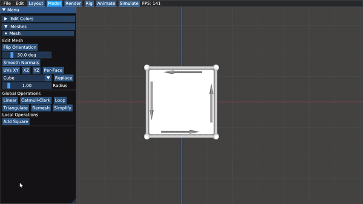
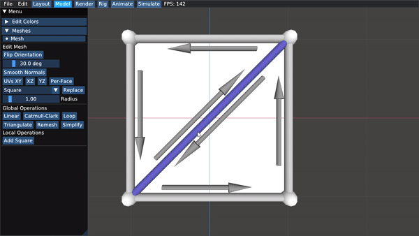
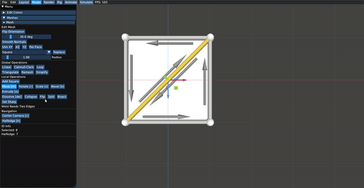

# Scotty3D

Scotty3D is the 3D modeling, rendering, and animation package that students complete as part of [15-462/662 Computer Graphics](http://15462.courses.cs.cmu.edu) at Carnegie Mellon University.

The current version of the starter code is available at https://github.com/CMU-Graphics/Scotty3D .

## Mesh Editing
In here we provide a plethra of mesh editing tools.
this was acomplished using half edge data structure for connectivity and some geometry for caluclations.

### Local operations

below are some examples of the implemented local operations.

| Face Operations |            Illustration            |            GIF from App            |
| :------------------: | :--------------------------------: | :--------------------------------: |
|        Inset         |  |  |

| Edge Operations |            Illustration            |                    GIF from App                     |
| :------------------: | :--------------------------------: | :-------------------------------------------------: |
|       Dissolve       |  |  |
|        Split         |  |  |
|         Flip         |  |  |

|
